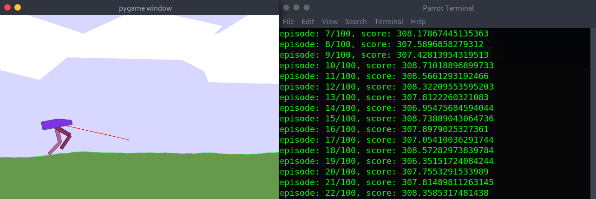

# Generate-A-Gait-For-A-Biped-Robot-Using-RL

<div align="center">
 
</div>

Making a Humanoid Robot to walk is a tough task. Reinforcement Learning helps solve this problem. Using Actor-Critic method a simulated biped robot has learned to walk. This paper is not published yet, coz the generated gait is not good enough. The code requires some work around to make it efficient.

Note: Some may experience installation issue. This is due to the hardware and pip  version. I have followed some links which help resolve the issue. You can find it in references.

### Run in Local Machine
```bash
git clone https://github.com/fxrarz/Research.git
cd Research/Real_Time_Motion_Control_Of_A_Humanoid_Robot_Using_Deep_Learning/
pip install -r requirement.txt
```

### Run in Colab
```bash
!git clone https://github.com/fxrarz/Research.git
!cd Research/Real_Time_Motion_Control_Of_A_Humanoid_Robot_Using_Deep_Learning/
!pip install -r colab_requirement.txt
```
