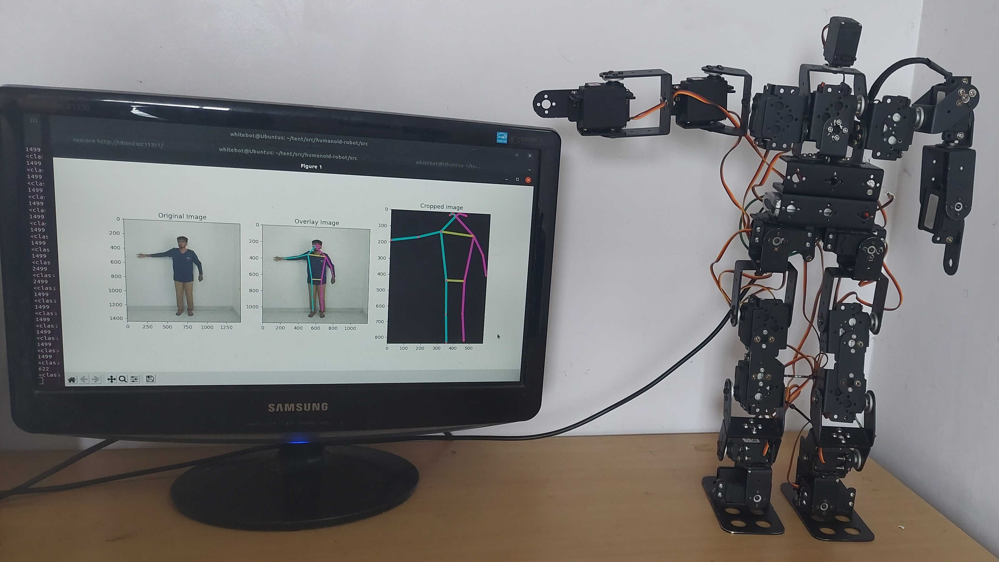

# Real-Time-Motion-Control-of-a-Humanoid-Robot-Using-Deep-Learning

<h1 align="center">
 
</h1>

Capture the motion of a Human from a 2D image using Pose Estimation and reproduce the action in a Humanoid Robot using Deep Learning.

Note: The repo currently has dataset creation and training code. For Controlling the humanoid ROS workspace is required. This is covered in a another repo.

### Demonstration Video
* [Youtube Link](https://www.youtube.com/watch?v=UsmOGdB1qRQ)

### Paper Links
* [View Publication](https://iopscience.iop.org/article/10.1088/1742-6596/2115/1/012007)
* [Download Paper](https://iopscience.iop.org/article/10.1088/1742-6596/2115/1/012007/pdf)
